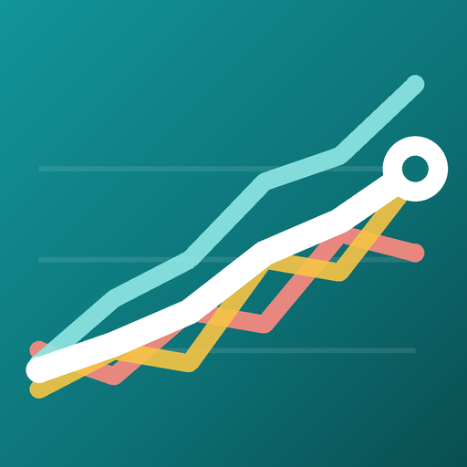

<p align="center">
  
</p>

<h1 align="center">Portfolio Optimizer Classic</h1>

<p align="center">
  An Android app that rebalances a private securities portfolio using the
  classical methods of portfolio theory &ndash; on the device, no account,
  no tracking.
</p>

<p align="center">
  <a href="../../releases/latest"></a>
  <a href="../../actions/workflows/build.yml"></a>
</p>

<p align="center"><a href="README.de.md">Diese Seite auf Deutsch</a></p>

---

## What the app does

You enter your holdings &ndash; ticker or ISIN, number of shares or a euro
amount &ndash; and the app downloads the full price history from Yahoo Finance,
converts everything to euro and puts the series on one shared time window.

On the optimisation screen, three sliders blend three classical objectives, and
you see immediately how your portfolio would change:

| Slider | Method | Goal |
| --- | --- | --- |
| **Minimum Variance** | Global Minimum Variance on a regularised covariance matrix; negative weights are clamped to 0 and the rest renormalised (long-only approximation) | smallest fluctuation |
| **Max Sharpe Ratio** | Tangency portfolio `Σ⁻¹μ` (risk-free rate = 0), clamped long-only &ndash; and checked against every single position as well as equal weights; the genuinely best Sharpe ratio wins | best return per unit of risk |
| **Min Drawdown** | derivative-free BOBYQA optimisation on the maximum drawdown | smallest interim loss |

If a method fails numerically, it falls back to equal weights.

Whatever share you do not assign stays in your current portfolio, so you can
blend continuously between "leave everything alone" and "fully optimised". The
table shows, for every position, how many shares you would have to buy or sell.

**Further properties**

- All methods are **long-only** &ndash; no short selling.
- Positions can be marked **fixed**; they stay untouched and their value is
  taken out of the optimisation.
- The total value of the portfolio is meant to survive every reallocation. A
  check with 0.1 % tolerance only logs deviations, it corrects nothing.
- The optimisation always runs on the **visible time window** of the chart:
  zoom the graph and it is recomputed. The series are sampled to at most 256
  equidistant points. Zooming is done by dragging horizontally &ndash; pinch
  zoom is explicitly disabled in the code.
- Up to 24 positions.
- All data stays on the device (`portfolio.json`): no account, no backend, no
  analytics. The manifest does set `android:allowBackup="true"` with the empty
  default backup rules, so Android's system-wide auto backup may include the
  file.

## Installation

1. Download the current `.apk` from [**Releases**](../../releases/latest).
2. On opening it, Android asks once for permission to install apps from this
   source (your browser or file manager) &ndash; confirm.
3. Install. Requires **Android 7.0 (API 24)** or newer.

> As long as no signing key is configured, the APK is signed with the Android
> debug key. It installs normally, but it cannot update an installation that
> carries a different signature. See [docs/RELEASING.md](docs/RELEASING.md).

## Using the app

Three screens: the portfolio with its chart, the asset management, and the
optimiser. The buttons at the bottom &ndash; **Assets**, **Sync** and
**Optimize** &ndash; take you there.

### Adding positions

**Assets** is where you enter your holdings.

1. Enter a **ticker or ISIN** &ndash; `VOO`, `SAP.DE`, `IE00B4L5Y983`. The app
   queries Yahoo Finance and loads the entire available price history.
2. Enter the **quantity**. By default that is a number of shares. Flip the
   **EUR** switch and you enter a euro amount instead, which the app converts
   into shares using the latest price &ndash; handy for savings plans, where you
   know the amount rather than the odd fractional share count.
3. **Alias** is optional. Without one the app shows the official name, which is
   sometimes along the lines of `iShares Physical Metals PLC O`; with an alias
   your own name is used everywhere.
4. **Fixed** excludes the position from the optimisation (see below).
5. **Add**.

If the search finds several papers &ndash; or one that is not exactly what you
typed &ndash; a dialog asks which one you mean, listing name, symbol and the
number of available price points. A single hit is only accepted without asking
when its symbol is literally what you typed. That is deliberate: Yahoo answers
`AAPL` with Apple *and* a row of leveraged products built on it, and none of
those should end up in your portfolio unnoticed.

> **Watch the number of price points.** Every method computes on the period all
> positions share &ndash; and that is only as long as the *shortest* series. A
> recently launched ETF with eight months of history shortens the window for
> your entire portfolio to eight months, no matter how far the others reach
> back. Covariances and drawdowns from that few points say very little. If the
> same exposure is available with a long history &ndash; another exchange, an
> older share class, the underlying index &ndash; take that one. In the list,
> the position that limits the window is marked *Limiting*.
>
> **Fixed** does not change this: the window is deliberately formed over *all*
> positions, excluded ones included, so that the chart shows exactly the period
> being computed on. A fixed position therefore takes no part in the
> optimisation but still limits the window. It only grows longer if you replace
> the short series with a longer one or remove it.

Once everything is entered, **Sync** fetches current prices for every position.

### Changing positions

- **Tapping** a row loads it back into the input fields; the button then reads
  **Update**. Leave the quantity alone and it is preserved exactly.
- **The red ✕** deletes the position.
- **Double-tapping** the same row shuffles its colour &ndash; useful when two
  lines in the chart look too similar. The narrow stripe on the left of each row
  shows the current colour; the bar next to the input field shows the colour a
  new position will get. That one is derived from the symbol, so it is always
  the same for the same paper.

### The optimiser

At the top, the chart with every position and, in black, your portfolio as a
whole. Below it three sliders, and below those the table with **ΔUnits** (how
many shares you would buy or sell) and **ΔAlloc** (how the share of the
portfolio shifts).

The three sliders blend continuously between your portfolio as it is today and
three target portfolios:

| Slider | Looks for | Typically leads to |
| --- | --- | --- |
| **Minimum Variance** | the calmest mixture | overweighting low-volatility papers |
| **Max Sharpe Ratio** | the best return *per unit of risk* | a mixture weighing return against calm |
| **Min Drawdown** | the smallest interim decline | overweighting papers that never fell far |

Together the three add up to at most 100 %; pull one up and the others give way
automatically. Whatever is missing from 100 % stays your current portfolio. All
sliders at 0 therefore means "change nothing", one slider at 100 means "go fully
for this objective". The total value of the portfolio stays the same in every
position &ndash; reallocated, not paid in or out.

**The zoom selects the period being computed on.** Drag horizontally in the
chart: to the left shortens the window, to the right lengthens it. The window
always ends at the current edge, so you only choose how far back to look. After
every zoom the app recomputes &ndash; a paper can look brilliant over ten years
and weak over six months, and the optimiser shows you exactly that.

### When a paper should be left alone

The **Fixed** switch takes a position out of all three optimisations: it keeps
its number of shares, its value is not redistributed, and it does not influence
the computation for the others either. Useful for anything you do not intend to
touch anyway, or for a money market fund &ndash; which otherwise wins almost
every comparison, because it barely fluctuates and never drops.

The switch applies to the current session and is deliberately not saved: after a
restart of the app, every position takes part again.

## Building it yourself

```bash
git clone https://github.com/Archimedes79/Portfolio_Optimizer_Classic.git
cd Portfolio_Optimizer_Classic
./gradlew assembleRelease      # Windows: gradlew.bat assembleRelease
```

The finished APK is then in `app/build/outputs/apk/release/`. You need JDK 21
to build and the Android SDK, platform 36 with minor API level 36.1; Android
Studio ships both. The unit tests run with `./gradlew testDebugUnitTest`.

The app icon is defined as an adaptive icon in
`app/src/main/res/mipmap-anydpi-v26/ic_launcher.xml`, its layers live in
`app/src/main/res/drawable/ic_launcher_*.xml`. The raster graphics for older
Android versions are regenerated from the same geometry by
`python3 tools/generate_icons.py`; the script needs Pillow and also writes
`docs/icon-512.png`, but it does not produce `ic_launcher_monochrome.xml`.

## Technology

Java, no Compose dependency, three activities.

| | |
| --- | --- |
| Mathematics | [Apache Commons Math 3](https://commons.apache.org/proper/commons-math/) (covariance matrix, BOBYQA) |
| Charts | [MPAndroidChart](https://github.com/PhilJay/MPAndroidChart) |
| Persistence | [Gson](https://github.com/google/gson) &rarr; `filesDir/portfolio.json` |
| Price data | public Yahoo Finance endpoints, monthly values interpolated linearly onto days; values before the first and after the last support point are clamped, not extrapolated |
| Currency | automatic conversion to EUR via the respective FX pair (including GBp); if fetching the exchange rate fails, the price is taken unchanged |

## Background

Started as a vibe-coding experiment &ndash; one that actually works.

## Disclaimer

This app is a learning and analysis tool. Its results are **not investment
advice**, not a recommendation, and not an offer to buy or sell financial
instruments. The price data comes from an unofficial, publicly reachable source;
it may be delayed, incomplete or wrong, and it may disappear at any time. Every
investment decision and its consequences are yours alone.

## Licence

Proprietary, source-available. Reading, private use and building it yourself are
permitted; redistribution and commercial use are not, without prior written
permission. Details in [LICENSE](LICENSE), notes on the libraries used in
[THIRD-PARTY-NOTICES.md](THIRD-PARTY-NOTICES.md).
